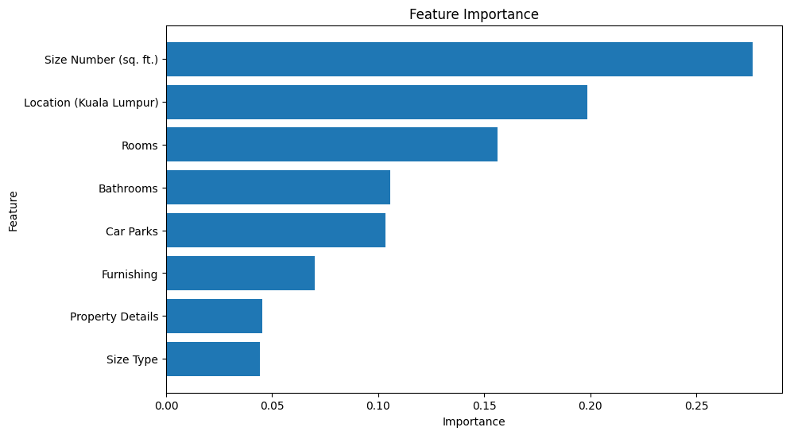

# 🧠 Kuala Lumpur Condominium Price Classification

This project is an **extension** of my exploratory data analysis work in [KL Property Analysis](https://github.com/MarcusWey/kl-property-analysis), shifting focus from descriptive statistics to **predictive machine learning**.

In this project, I applied multiple machine learning models to classify Kuala Lumpur condominiums into price range categories (Low, Medium, High, Extremely High) using features such as size, location, number of rooms, and amenities. The goal was to evaluate model performance, interpret feature importance, and explore each algorithm’s suitability for real estate price prediction.

---

🔄 Project Status

- ✅ Classification complete using SVM, MLP, Random Forest, and XGBoost  
- 🧪 Models evaluated with accuracy, F1, ROC AUC, confusion matrices  
- 📊 Feature importance extracted:

- 

- 🔁 **Next:** Extend to regression-based price prediction

---

## 🧪 Models Used

| Model          | Test Accuracy | Validation Accuracy |
|----------------|---------------|---------------------|
| XGBoost        | 81.59%        | 82.49%              |
| Random Forest  | 79.14%        | 79.60%              |
| MLP            | 72.89%        | 73.90%              |
| SVM            | 65.34%        | 66.84%              |

> 🏆 **XGBoost** achieved the best balance of accuracy and generalization.

---

## 🧠 Feature Importance

Based on the XGBoost model, these were the most influential features in predicting price categories:

| Rank | Feature                 | Importance |
|------|-------------------------|------------|
| 1️⃣   | Size Number (sq. ft.)    | 🟦 Highest |
| 2️⃣   | Location (Kuala Lumpur) | 🟦 High    |
| 3️⃣   | Rooms, Bathrooms, Car Parks | 🟦 Moderate |
| 4️⃣   | Furnishing, Property Details, Size Type | 🟦 Lower impact |

---

## 📌 Dataset

- Subset of cleaned **Condominium properties**
- Source: [KL Property Listings on Kaggle](https://www.kaggle.com/datasets/dragonduck/property-listings-in-kuala-lumpur)
- Classes: `Low`, `Medium`, `High`, `Extremely High` price range
- Balanced using SMOTE

---

## 📊 Evaluation Metrics

- ✅ Accuracy (training, validation, test)
- ✅ Precision, Recall, F1-score per class
- ✅ ROC-AUC curves
- ✅ Confusion matrices

---

